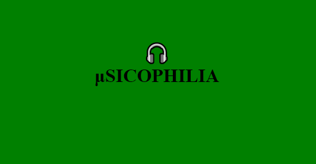

<!-- PROJECT LOGO -->
<p align="center">
    
  </a>

  <p align="center">
    "Musicophilia"
    <br /><br />
    <a href="https://youtu.be/D8yykcH3j2U">Video Demo</a> || <a href="https://nilisha-jais.github.io/Musicophilia/">Live Site</a>
  </p>
</p>
<center>


<!-- ABOUT THE PROJECT -->

## About The Project 🚀

Musicophilia is a platform for <strong>Music Lovers </strong> 🎵
<br/>
You can listen to your favourite music🎧, try your hands on the band and the piano🎹, play music related games and dance on the music beats!💃

## Frameworks 🧰

- HTML
- CSS
- JavaScript


## Setting up the project for running at localhost 💻

### Forking repository :
- Firstly you have to make your own copy of the project. For that, You have to fork the repository. You can find the fork button on the top-right side of the browser window. 
- Kindly wait till it gets forked.
- After that copy will look like <your-user-name>/Musicophilia forked from nilisha-jais/Musicophilia
 
### Clone repository :
- Now you have your own copy of the project. Here you have to start your work.
- Go to the desired location on your computer where you want to set up the project.
- Right-click there and click on git bash. A terminal window will pop up.
- Type the command git clone <your-fork-url>.git and hit enter. (as shown below)
```sh
git clone https://github.com/<your_user_name>/Musicophilia.git
```
- Wait for few seconds till the project gets copied.

Now you are ready to go✔️
Happy contributing🌟

## Our Contributors
### Credits goes to these people:✨

<table>
<tr>
<td>
<a href="https://github.com/nilisha-jais/Musicophilia/graphs/contributors">

</a>
</td>
</tr>
</table>

