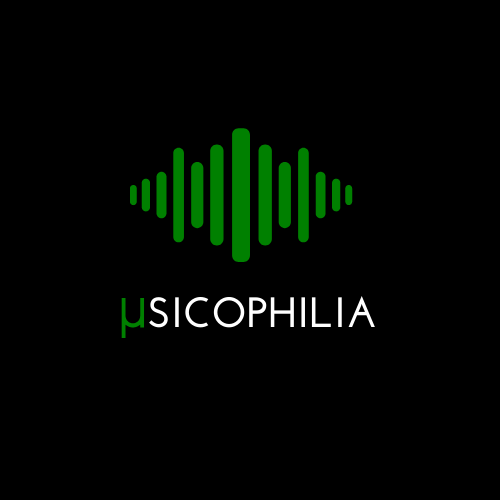

# Musicophilia 🎧
<!-- PROJECT LOGO -->
<p align="center">
    

  <p align="center">
    <a href="https://youtu.be/D8yykcH3j2U">Video Demo</a> || <a href="https://nilisha-jais.github.io/Musicophilia/">Live Site</a>
  </p>
</p>

<div align="center">

[](https://github.com/nilisha-jais/Musicophilia)&nbsp;
[](https://github.com/nilisha-jais/Musicophilia)&nbsp;
&nbsp;
[](https://musicophilia.netlify.app/)&nbsp;
<a href="https://app.slack.com/client/T022A4RL16V/C02435ZJUCV">
 
</a>

[](https://github.com/nilisha-jais/Musicophilia/stargazers)
[](https://github.com/nilisha-jais/Musicophilia/network/members)
[](https://github.com/nilisha-jais/Musicophilia/graphs/contributors)
[](https://github.com/nilisha-jais/Musicophilia/issues)
[](https://github.com/nilisha-jais/Musicophilia/pulls)
[](https://github.com/nilisha-jais/Musicophilia/pulls)
[](https://github.com/nilisha-jais/Musicophilia/pulls)

</div>
    
## About The Project

A platform for <strong>Music Lovers </strong>
<br/>
You can listen your favourite music 🎧 ,try your hands on the band and the piano 🎹, play music related games and dance on the music beats💃.

## Built With
The project is built using<br/><br/>
[](https://github.com/nilisha-jais/Musicophilia/search?l=html)&nbsp;
[](https://github.com/nilisha-jais/Musicophilia/search?l=css)&nbsp;
[](https://github.com/nilisha-jais/Musicophilia/search?l=javascript)


<!--Updated Readme file which helps beginners contribute to open source-->
## 📌 Getting Started ⭐

Refer to the following articles on the basics of Git and Github and can also contact the Project Mentors, in case you are stuck:

- If you don't have git on your machine, [install](https://help.github.com/articles/set-up-git/) it.
- [Watch this video to get started, if you have no clue about open source](https://youtu.be/SL5KKdmvJ1U)
- [Forking a Repo](https://help.github.com/en/github/getting-started-with-github/fork-a-repo)
- [Cloning a Repo](https://docs.github.com/en/github/creating-cloning-and-archiving-repositories/cloning-a-repository-from-github/cloning-a-repository)
- [How to create an Issue](https://docs.github.com/en/issues/tracking-your-work-with-issues/creating-issues/creating-an-issue)
- [How to create a Pull Request](https://opensource.com/article/19/7/create-pull-request-github)
- [Getting started with Git and GitHub](https://towardsdatascience.com/getting-started-with-git-and-github-6fcd0f2d4ac6)

## 📜 Instructions to follow while contributing to Musicophilia
[](http://makeapullrequest.com)
[](https://github.com/ellerbrock/open-source-badges/)

Are you a newbie in the world of open source and want to Contribute to our Open Source Project ?
Don't worry we got your back 

Below are the steps to follow to contribute to this project:

**1.**  Fork [this](https://github.com/nilisha-jais/Musicophilia) repository.   

**2.**  Clone your forked copy of the project.
```
git clone --depth 1 https://github.com/<your_user_name>/Musicophilia.git
```
where `your_user_name` is your GitHub username. Here you're copying the contents of the first-contributions repository on GitHub to your computer.

**3.** Navigate to the project directory :file_folder: .
```
cd Musicophilia
```
**4.** Add a reference(remote) to the original repository.
```
git remote add upstream https://github.com/nilisha-jais/Musicophilia.git 
```
**5.** Check the remotes for this repository.
```
git remote -v
```
**6.** Always take a pull from the upstream repository to your main branch to keep it at par with the main project(updated repository).
```
git pull upstream main
```
**7.** Create a new branch.
```
git checkout -b <your_branch_name>
```

**8.** Make necessary changes and commit those changes
<p align="center"></p>

**9.** Track your changes:heavy_check_mark: .
```
git add . 
```
**10.** Commit your changes .
```
git commit -m "Relevant message"
```
**11.** Push the committed changes in your feature branch to your remote repo.
```
git push -u origin <your_branch_name>
```

**12.** To create a pull request, click on `compare and pull requests`. Please ensure you compare your feature branch to the desired branch of the repo you are suppose to make a PR to.


**13.** Add appropriate title and description to your pull request explaining your changes and efforts done.

**14.** Click on `Create Pull Request`.


**15.** Hurray :exclamation: You have created a PR to the Musicophilia :boom: . Sit back patiently and relax till then the project maintainers will review your PR. Please understand,  there will be some time taken to review a PR and can vary from a few hours to a few days too so be Patient and keep contributing.

## 📌Till Then 
<p align="center"></p>


### This project is a part of following Open Source Program
<table style="width:80%;background-color:white;border-radius:30px;">
    <tr>
  <td>

  
  </td>
  </tr>
</table>
<br>
<h1 align=center> Project Admin ❤️ </h1>
  
<table align=center>
<tr>
<td align="center"><a href="https://github.com/nilisha-jais"></a></br> <h4 style="color:red;">nilisha jais</h4>
</tr>
</table>
<br>

## The geeks🤓 behind this initiative:

#### Our valuable Contributors👩‍💻👨‍💻 :
<a href="https://github.com/nilisha-jais/Musicophilia/graphs/contributors">
  
</a>

## Code of Conduct
<p align="center"><a href="https://github.com/nilisha-jais/Musicophilia/blob/main/CODE_OF_CONDUCT.md"></a></p>

## License 
<p align="center"><a href="https://github.com/nilisha-jais/Musicophilia/blob/main/LICENSE"></a></p>
<div align="center">

[](https://forthebadge.com)
[](https://forthebadge.com) 
[](https://forthebadge.com) 

</div>
